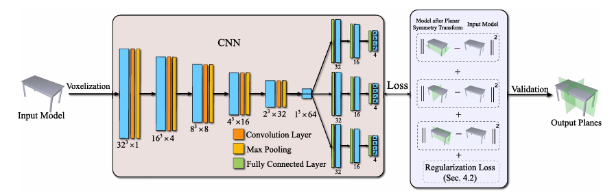

##  PRS-Net: Planar Reflective Symmetry Detection Net for 3D Models


This is from a paper by Prof. Lin Gao published in 2021.(TVCG 2021)
Here is the original paper link:[PRS-Net: Planar Reflective Symmetry Detection Net for 3D Models](https://arxiv.org/pdf/1910.06511)

This repositories' method managing datasets coming from :[https://github.com/IGLICT/PRS-Net?tab=readme-ov-file]
###  Background & Motivation

- **Problem**: Traditional symmetry detection methods (e.g., spatial sampling/PCA) are slow and miss non-orthogonal symmetry planes.
- **Key Insight**: Leverage unsupervised 3D CNN to directly learn symmetry parameters from voxelized shapes.

### Contributions

**PRS-Net Core Innovations**

1. **First Unsupervised DL Solution for Planar Reflective Symmetry Detection**
   - Achieves **100-1000× speedup** compared to state-of-the-art sampling-based methods
   - Processes 3D models in **1.81ms** (vs. 510ms for traditional approaches)
2. **Novel Dual-Loss Framework(two loss functions)**

<u>Symmetry Distance Loss</u> and <u>Regularization Loss</u>

### Key Components:

- **Input**: Voxelized 3D models (32×32×32 resolution)
- **Network**: 5-layer 3D CNN → Fully Connected Layers
- Output
  - **Symmetry Planes**: Normal vector + offset (3 planes)
  - **Rotation Axes**: Quaternion representation (3 axes)

### Loss Functions:

1. **Symmetry Distance Loss (L_sd)**
    Measures deviation between original shape and reflected/rotated counterparts.

   - For reflection: 
     $$
     q'_k = q_k - 2(q_k·n_i + d_i) n_i
     $$
     

   - For rotation: Quaternion transformation

   - Computes shortest distance between transformed points and original surface

2. **Regularization Loss (L_r)**
    Prevents duplicated outputs by enforcing orthogonality:
   $$
   L_r = ||M1M1^T - I||_F^2 + ||M2M2^T - I||_F^2
   $$

3. **Validation Stage**
    Filters invalid/duplicated outputs using:

   - Dihedral angle threshold (π/6)
   - Symmetry error threshold (4×10^-4)
### The way to get and process the dataset:

you can get the dataset through this link or from the huggingface.io:

https://pan.baidu.com/s/1WnJIAk4slq99GzE08dELqA?from=init

then you should run:

```shell
python preprocessed.py
```

you can get a folder named processed(content like this pic2),then you can follow steps down this.


### The device requirement:

I train model using RTX 4060(8GB) for 300 epoches for 10 hours,i use cuda(which is shown in requirements.txt),but you can also use cpu if you can accept the very slow speed.

I open my train model in link:best_model_weights.pth
: https://pan.baidu.com/s/1NkVOJPDOgVAV6J7ZVQSPUw?pwd=t4v5   code: t4v5

### The way to run my code:

```shell
conda create -n prsnet python=3.10
pip install -r requirements.txt
conda activate prsnet

#(if you wanna train mode):
#please run:
python train.py
#(if you wanna demo,you can just run :
python demo.py
#you can get the pridected plane demo for your 3D model
#if you wanna view dataset different files,please apply the fuction in 
python viewer.py
#have binvox view, pointclouds view and so on...
```

